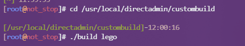

# Hướng dẫn xử lý lỗi cài SSL trên Directadmin nhưng không nhận

Thường chúng ta sẽ gặp các lỗi như cài SSL không được hoặc cài SSL báo thành công nhưng khi check thì SSL vẫn không nhận.

Trường hợp 1: Cài SSL gặp lỗi
Sau khi click vào việc cài SSL thì ra về lỗi:

Thì ở đây do chúng ta chưa trỏ tên miền này về IP hosting

Trường hợp 2: Là lỗi do SSL let'encrypt bị lỗi
 Ở trường hợp này chúng ta cần SSH vào VPS và thao tác các lệnh sau:
cd /usr/local/directadmin/custombuild

./build lego

 

 

 ./build letsencrypt

 

 touch /root/.zerossl

 

 Sau đó chúng ta quay lại giao diện Directadmin và gen lại SSL

 Trường hợp 3: Cài SSL báo thành công nhưng khi kiểm tra thì vẫn chưa nhận SSL

 Ở đây sau khi cài báo thành công
 

 Nhưng khi kiểm tra bằng tools hoặc trên website thì SSL vẫn chưa cập nhật.

 

 Thì khi đó chúng ta cần vào VPS dùng lệnh sau để cập nhật SSL:

 systemctl reload nginx

 Sau khi chạy lệnh này hệ thống trả về lỗi thì chúng ta cần thao tác 2 lệnh sau:
 cd /usr/local/directadmin/custombuild
 ./build nginx_apache

 Sau khi hoàn thành quá trình build nginx_apache.

 Chúng ta quay lại giao diện Directadmin để gen lại SSL.

 Chúc các bạn thành công!
 