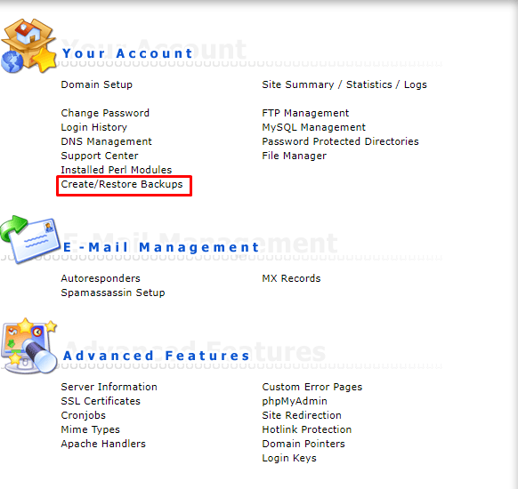
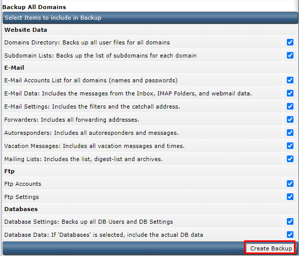
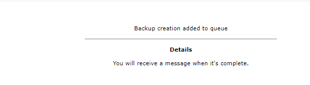
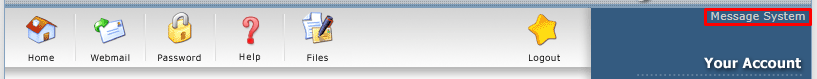
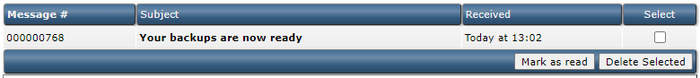
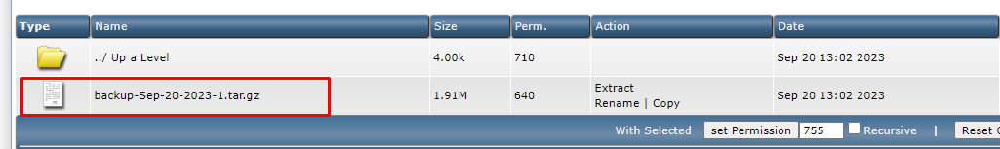

# Hướng dẫn download backup trên Directadmin

Các bước thực hiện quá trình download file backup trên Panel Directadmin.

Bước 1: Ta cần login vào giao diện Directadmin.

 

Bước 2: Chọn mục "**Show All USers**" để chọn user mà bạn muốn tạo backup vào download backup về

Bước 3: Login vào user mà bạn muốn backup. Sau đó chọn mục "**Create/Restore Backups**"

Bước 4: Chọn "**Create Backup**"

Sau khi hoàn thành bước này vui lòng xem trong mục **Message System**

Sau đó ta vào đường dẫn: "File Manager ==> backups ==> backup-thang-ngay-nam.tar.gz"

Click vào file backup-thang-ngay-nam.tar.gz để có thể download backup

Chúc các bạn thành công!