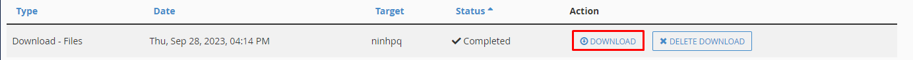

# Hướng dẫn download backup Cpanel

Bước 1: Truy cập vào giao diện Cpanel ==> Ở trong **Mục JetBackup** ta chọn **File Backups**

Bước 2: Sau khi vào giao diện File Backups sẽ có các ngày backup như sau:

Chọn ngày mà muốn backup sau đó click vào File Manager

Bước 3: Chọn thư mục mà mình muốn backup ==> Chọn Download Selected ==> Add Queue để tạo bản download backup trên server.

Bước 4: Trở lại **Mục Jet Backup** ==> **Chọn Mục Queue** để có thể download bản backup nhé.
 

 Chúc các bạn thành công!
