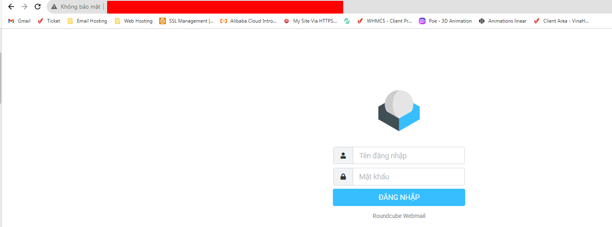
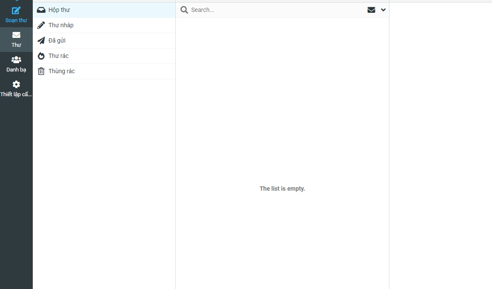

# Lỗi Roundcube không kết nối được đến database

**Lỗi:**
**DATABASE ERROR!
Unable to connect to the database!
Please contact your server administrator.**

Bước 1: SSH vào VPS

Bước 2: 
cat /usr/local/directadmin/conf/mysql.conf

mysql -u da_admin -p

DROP DATABASE da_roundcube;

quit

cd /usr/local/directadmin/custombuild

./build roundcube

<pre>[root@not_stop]# cat /usr/local/directadmin/conf/mysql.conf
user=da_admin
passwd=EC5VM5fZBUJk1do
[root@not_stop]# mysql -u da_admin -p
Enter password: 
Welcome to the MariaDB monitor.  Commands end with ; or \g.
Your MariaDB connection id is 252981
Server version: 10.2.32-MariaDB MariaDB Server

Copyright (c) 2000, 2018, Oracle, MariaDB Corporation Ab and others.

Type 'help;' or '\h' for help. Type '\c' to clear the current input statement.

MariaDB [(none)]&gt; DROP DATABASE da_roundcube;
Query OK, 14 rows affected (0.04 sec)

MariaDB [(none)]&gt; quit
Bye
[root@not_stop]# cd /usr/local/directadmin/custombuild
[root@not_stop custombuild]# ./build roundcube
Inserting data to mysql and creating database/user for roundcube...
Found MySQL version 10.2
Creating User: CREATE USER 'da_roundcube'@'localhost' IDENTIFIED BY 'PPoQQSvIMrCKDO';
Granting access: GRANT SELECT,INSERT,UPDATE,DELETE,CREATE,DROP,ALTER,LOCK TABLES,INDEX,REFERENCES ON da_roundcube.* TO 'da_roundcube'@'localhost';
Setting password: SET PASSWORD FOR 'da_roundcube'@'localhost' = PASSWORD('PPoQQSvIMrCKDO');
Database created, da_roundcube password is PPoQQSvIMrCKDO
Editing roundcube configuration...
Roundcube 1.4.8 has been installed successfully.
WARNING: Changed defaults (These config options have new default values):
- 'skin'
- 'smtp_port'
- 'smtp_user'
- 'smtp_pass'
- 'jquery_ui_skin_map'
Executing database schema update.
NOTICE: Update dependencies by running `php composer.phar update --no-dev`
done.
This instance of Roundcube is up-to-date.
Have fun!
Reloading php-fpm56.
Reloading service php-fpm56:  done
</pre>

Sau khi xử lý lỗi trên chúng ta đã có thể truy cập vào giao diện webmail:

Ở đây sau khi login bằng username và password thì sẽ có lỗi **"connection to IMAP server failed"**

Chúng ta sẽ xử lý bằng cách:

<pre>
Chỉnh sửa cấu hình trong file sau: /var/www/html/roundcube1-6-0/conf/config.inc.php
$config['imap_host'] = 'localhost:143'; ==> $config['imap_host'] = '127.0.0.1';

Sau đó ./build roundcube
</pre>
Truy cập và webmail và login lại để kiểm tra.

Chúc các bạn thành công!

